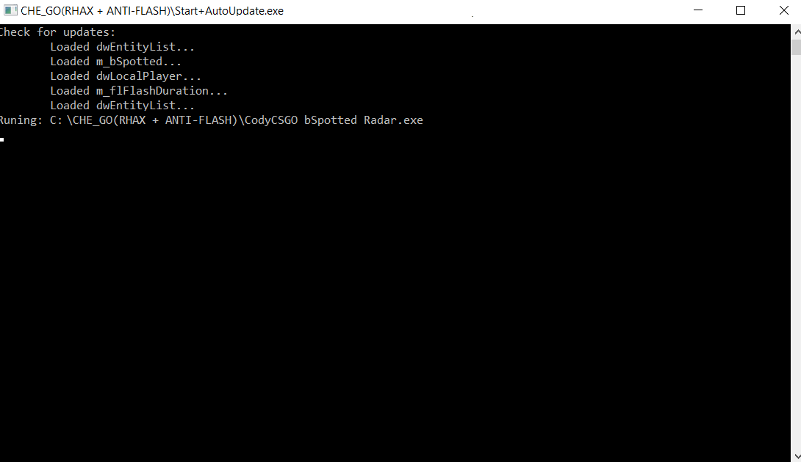

# CS-GO-RadarHack-Antiflash
<h1>AUTO-UPDATED CHEAT FOR CS:GO ⚡
<h3>The author of the parser 👉 https://github.com/TheWayToJunior<h3>
  </h1>
<h3>
  <h2>
Instruction 📋 
</h2>
<ol>
<li>Compiling CS:GO Launcher & CS:GO bspotted Radar in release vesrion 🔨</li>
<li>Go to CodyCSGO bSpotted Radar1\СS_GO_Launcher\Release 💨</li>
<li>Run CS:GO launcher.exe 🌌</li>
<li>Open file CodyCSGO bSpotted Radar1\Release\CodyCSGO bSpotted Radar.exe in FileDialog 📁</li>
 <li> Result autoupdated cheat: ⭐</li>
 
 
 
<li>Cheat activated have a nice game 💻</li>
</ol>
</h3>

P.S. A cheat that is difficult to detect VAC 🚔 

